# 🔐 Authentication Flow Diagrams

Complete visual guide to the authentication system including registration, login, token management, and security flows.

## Table of Contents
- [1. Registration & Login Flow](#1-registration--login-flow)
- [2. Protected Request Validation](#2-protected-request-validation)
- [3. Token Refresh Flow](#3-token-refresh-flow)
- [4. Token Rotation Strategy](#4-token-rotation-strategy)
- [5. Token Usage Reference](#5-token-usage-reference)
- [6. Logout Flow](#6-logout-flow)
- [7. Password Verification Flow](#7-password-verification-flow)
- [FAQ](#faq)

---

## 1. Registration & Login Flow

Shows the complete flow from user registration to receiving authentication tokens.

```mermaid
sequenceDiagram
    participant F as Frontend
    participant B as Backend
    participant DB as Database

    Note over F,DB: REGISTRATION FLOW
    F->>B: POST /auth/register<br/>{email, password}
    B->>DB: Check if email exists
    DB-->>B: Email available
    B->>B: Hash password (bcrypt, 10 rounds)
    B->>DB: Create admin record
    DB-->>B: Admin created
    B-->>F: {id, email}
    F->>F: Show success message<br/>Redirect to login

    Note over F,DB: LOGIN FLOW
    F->>B: POST /auth/login<br/>{email, password}
    B->>DB: Find admin by email
    DB-->>B: Admin record with hashed password
    B->>B: bcrypt.compare(password, hashedPassword)
    
    alt Password Valid
        B->>B: Generate JWT tokens<br/>• accessToken (15min)<br/>• refreshToken (7days)
        B->>DB: Store refreshToken<br/>with expiresAt = now + 7 days
        DB-->>B: Token stored
        B-->>F: {<br/>  accessToken,<br/>  refreshToken,<br/>  admin: {id, email}<br/>}
        F->>F: Store tokens in localStorage:<br/>• access_token<br/>• refresh_token
        F->>F: Redirect to /admin/events
    else Password Invalid
        B-->>F: 401 Unauthorized<br/>"Invalid credentials"
        F->>F: Show error message
    end
```



**Key Points:**
- Password is hashed with bcrypt (10 rounds) before storage
- Login returns BOTH tokens immediately
- Refresh token is stored in database for validation and revocation
- Access token is NOT stored in database (stateless JWT)

---

## 2. Protected Request Validation

Shows how EVERY protected API request is validated using JWT authentication.

```mermaid
sequenceDiagram
    participant F as Frontend
    participant G as JwtAuthGuard
    participant S as JwtStrategy
    participant DB as Database
    participant C as Controller

    Note over F,C: SCENARIO 1: VALID ACCESS TOKEN
    F->>G: GET /events<br/>Authorization: Bearer {accessToken}
    G->>S: Validate JWT
    S->>S: 1. Verify JWT signature<br/>   using JWT_SECRET
    S->>S: 2. Check expiration<br/>   exp > now?
    S->>S: 3. Extract payload<br/>   {sub: adminId, email}
    S->>DB: 4. Find admin by ID<br/>   SELECT * WHERE id = sub
    DB-->>S: Admin record exists
    S->>S: 5. Create user object<br/>   {id, email}
    S-->>G: ✅ User validated
    G->>C: Attach user to request<br/>req.user = {id, email}
    C->>C: Access user via<br/>@CurrentUser() decorator
    C->>DB: Query events with filters
    DB-->>C: Events data
    C-->>F: 200 OK<br/>{data: [...], meta: {...}}

    Note over F,C: SCENARIO 2: EXPIRED ACCESS TOKEN
    F->>G: GET /events<br/>Authorization: Bearer {expiredToken}
    G->>S: Validate JWT
    S->>S: 1. Verify JWT signature
    S->>S: 2. Check expiration
    S-->>G: ❌ Token expired (exp < now)
    G-->>F: 401 Unauthorized<br/>"Unauthorized"
    F->>F: Axios interceptor catches 401<br/>→ Trigger token refresh
```



**Key Points:**
- Only access token is sent in `Authorization` header
- JWT Guard validates EVERY protected request
- Database query verifies user still exists (not deleted/banned)
- Expired tokens immediately return 401

---

## 3. Token Refresh Flow

Shows automatic token refresh when access token expires (transparent to user).

```mermaid
sequenceDiagram
    participant F as Frontend
    participant I as Axios Interceptor
    participant B as Backend (AuthService)
    participant DB as Database

    Note over F,DB: ACCESS TOKEN EXPIRED
    F->>B: GET /events<br/>Authorization: Bearer {expiredAccessToken}
    B-->>F: 401 Unauthorized

    Note over F,DB: AUTO REFRESH TRIGGERED (Transparent to User)
    F->>I: Response interceptor catches 401
    I->>I: Get refreshToken from localStorage
    I->>B: POST /auth/refresh<br/>{refreshToken}

    B->>B: 1. Verify refresh JWT signature<br/>   using JWT_REFRESH_SECRET
    B->>DB: 2. Find token in database<br/>   WHERE token = refreshToken
    DB-->>B: Token record found

    alt Refresh Token Valid
        B->>B: 3. Check expiration<br/>   expiresAt > now?
        B->>DB: 4. DELETE old refresh token
        DB-->>B: Old token deleted
        
        B->>B: 5. Generate NEW tokens<br/>   • newAccessToken (15min)<br/>   • newRefreshToken (7days)
        
        B->>DB: 6. INSERT new refresh token<br/>   expiresAt = now + 7 days
        DB-->>B: New token stored
        
        B-->>I: 200 OK<br/>{<br/>  accessToken: new,<br/>  refreshToken: new<br/>}
        
        I->>I: Update localStorage<br/>• access_token = new<br/>• refresh_token = new
        
        I->>B: RETRY original request<br/>GET /events<br/>Authorization: Bearer {newAccessToken}
        B-->>F: 200 OK<br/>{data: [...], meta: {...}}
        
        Note over F: User sees successful response<br/>Refresh was invisible!
        
    else Refresh Token Invalid/Expired
        B-->>I: 401 Unauthorized<br/>"Invalid refresh token"
        I->>I: Clear localStorage<br/>• remove access_token<br/>• remove refresh_token
        I->>F: Redirect to /admin/login
        Note over F: User must login again
    end
```



**Key Points:**
- Refresh happens automatically via Axios interceptor
- User experience is seamless (no interruption)
- Old refresh token is deleted (token rotation)
- New refresh token extends expiry by 7 days from NOW
- If refresh fails, user is logged out

---

## 4. Token Rotation Strategy

Visual representation of how tokens are rotated for security.

```mermaid
flowchart TD
    A[User Logs In] --> B[Generate Initial Tokens]
    B --> C["accessToken: expires in 15min<br/>refreshToken: expires in 7 days"]
    C --> D[Store refreshToken in Database<br/>expiresAt = now + 7 days]
    D --> E[Return both tokens to frontend]
    E --> F[Frontend stores in localStorage]

    F --> G{User Makes API Request}
    
    G -->|Access Token Valid| H[Send in Authorization header]
    H --> I[Request succeeds immediately]
    I --> J[No token refresh needed]
    J --> G
    
    G -->|Access Token Expired| K[Backend returns 401]
    K --> L[Axios interceptor catches error]
    L --> M[Send refreshToken to /auth/refresh]
    
    M --> N{Is Refresh Token Valid?}
    
    N -->|Yes| O["🔄 TOKEN ROTATION"]
    O --> P["1. Delete OLD refreshToken from DB"]
    P --> Q["2. Generate NEW accessToken (15min)"]
    Q --> R["3. Generate NEW refreshToken (7days)"]
    R --> S["4. Store NEW refreshToken in DB<br/>expiresAt = now + 7 days"]
    S --> T["5. Return NEW tokens to frontend"]
    T --> U[Frontend updates localStorage]
    U --> V[Retry original request with NEW access]
    V --> G
    
    N -->|No - Expired/Invalid| W[Return 401 error]
    W --> X[Clear all tokens from storage]
    X --> Y[Redirect to login page]
    
    style O fill:#ff6b6b,color:#fff
    style P fill:#ffd43b
    style Q fill:#51cf66,color:#fff
    style R fill:#51cf66,color:#fff
    style S fill:#ffd43b
    style Y fill:#ff6b6b,color:#fff
```



**Security Benefits:**
- 🔒 Old tokens immediately invalidated
- 🔄 Token reuse attacks prevented
- ⏰ Active users stay logged in indefinitely
- 🚪 Inactive users (7+ days) auto logout
- 🗑️ Database can revoke tokens anytime

---

## 5. Token Usage Reference

Quick reference for when and where each token is used.


**Summary Table:**

| Endpoint Type | Authentication | Token Used | Location |
|---------------|----------------|------------|----------|
| Admin Routes | ✅ Required | `accessToken` | `Authorization: Bearer {token}` header |
| Token Refresh | ⚠️ Special | `refreshToken` | Request body `{refreshToken}` |
| Logout | ⚠️ Special | `refreshToken` | Request body `{refreshToken}` |
| Public Routes | ❌ None | None | No authentication |

---

## 6. Logout Flow

Shows how logout invalidates the refresh token.


**Key Points:**
- Logout deletes refresh token from database
- Access token may still work until it expires (15 min max)
- Cannot get new access token after logout (refresh token deleted)
- Frontend clears all stored data

---

## 7. Password Verification Flow

Shows the dual security check for sensitive operations (like delete).


**Dual Security Layers:**
1. **JWT Authentication**: Verifies user is logged in
2. **Password Verification**: Confirms user intent for sensitive action
3. **Ownership Check**: Ensures user can only delete their own events

---

## FAQ

### Q1: Do I send refresh token with every request?
**A: ❌ NO** - Only send `accessToken` in the `Authorization` header for regular requests. The `refreshToken` is ONLY used when calling `/auth/refresh` endpoint.

### Q2: When does token refresh happen?
**A: ⏰ Only when access token expires** - Frontend automatically detects 401 error and triggers refresh. This happens every ~15 minutes of activity.

### Q3: Does refresh token get refreshed?
**A: ✅ YES** - Both tokens are regenerated during refresh (token rotation). Old refresh token is deleted, new one extends expiry by 7 days.

### Q4: Can I stay logged in forever?
**A: ✅ YES, if active** - As long as you make at least one request within 7 days, your refresh token expiry keeps extending. Inactive users (7+ days) must login again.

### Q5: Where are tokens stored?
**A:**
- **Access Token**: Frontend localStorage only (not in DB - stateless JWT)
- **Refresh Token**: Both frontend localStorage AND database (for validation/revocation)

### Q6: What happens if someone steals my refresh token?
**A: 🔒 Security measures:**
- Token is deleted during refresh (one-time use)
- Stored with expiry date in database
- Can be manually revoked by admin
- Original user's next refresh will create new token

### Q7: Why delete event requires password?
**A: 🛡️ Extra security** - Prevents accidental or malicious deletion. Even if JWT is compromised, attacker needs password.

### Q8: Can admin see other admins' events?
**A: ✅ Can see, ❌ Cannot modify** - All admins can view events, but can only modify/delete their own (ownership check).

### Q9: What's the token flow timeline?
```
Login → Get tokens (access: 15min, refresh: 7days)
  ↓
Make requests (access token in header)
  ↓
15 minutes later → Access expires → 401 error
  ↓
Auto refresh (transparent) → New tokens (access: 15min, refresh: 7days from NOW)
  ↓
Repeat... (stays logged in as long as active)
  ↓
7 days of inactivity → Refresh expires → Must login
```

### Q10: How do I test token expiry?
**A: Set short expiry in `.env`:**
```env
JWT_EXPIRATION=30s        # Access expires in 30 seconds
JWT_REFRESH_EXPIRATION=2m # Refresh expires in 2 minutes
```
Then make requests and watch auto-refresh happen!

---

## Related Documentation

- [📋 Implementation Plan](./IMPLEMENTATION_PLAN.md) - Overall project structure
- [📊 Events Flow Diagrams](./EVENTS_FLOWS.md) - Events CRUD operations
- [🔧 Backend API Documentation](./backend/README.md) - API endpoints reference

---

**Last Updated**: 2025-11-10
**Version**: 1.0.0
