# 📊 Events Management Flow Diagrams

Complete visual guide to all events operations including CRUD, filtering, pagination, and file uploads.

## Table of Contents
- [1. Create Event Flow](#1-create-event-flow)
- [2. List Events Flow](#2-list-events-flow)
- [3. Update Event Flow](#3-update-event-flow)
- [4. Delete Event Flow](#4-delete-event-flow)
- [5. Public Events Flow](#5-public-events-flow)
- [6. File Upload Flow](#6-file-upload-flow)
- [Quick Reference](#quick-reference)

---

## 1. Create Event Flow

Shows complete flow from form submission to database including poster upload.

```mermaid
sequenceDiagram
    participant F as Frontend
    participant UC as UploadsController
    participant EC as EventsController
    participant ES as EventsService
    participant DB as Database
    participant FS as File System

    Note over F,FS: STEP 1: Upload Event Poster
    F->>F: User fills form:<br/>• Name<br/>• Start/End dates<br/>• Location<br/>• Poster image
    F->>F: User submits form
    
    F->>UC: POST /uploads<br/>Content-Type: multipart/form-data<br/>file: {poster.jpg}
    UC->>UC: Validate file:<br/>• Type: jpg/png/webp<br/>• Size: < 5MB
    
    alt File Valid
        UC->>FS: Save to ./uploads/<br/>filename: file-{timestamp}-{random}.jpg
        FS-->>UC: File saved
        UC-->>F: 200 OK<br/>{<br/>  url: "/uploads/file-123.jpg",<br/>  filename: "file-123.jpg"<br/>}
        
        Note over F,FS: STEP 2: Create Event with Poster URL
        F->>EC: POST /events<br/>Authorization: Bearer {accessToken}<br/>{<br/>  name: "Tech Conference 2025",<br/>  startDate: "2025-03-01",<br/>  endDate: "2025-03-03",<br/>  location: "Singapore",<br/>  posterUrl: "/uploads/file-123.jpg"<br/>}
        
        EC->>EC: @UseGuards(JwtAuthGuard)<br/>req.user = {id, email}
        EC->>ES: create(createEventDto, user.id)
        ES->>ES: Validate dates:<br/>endDate > startDate?
        
        ES->>DB: INSERT INTO events<br/>(name, startDate, endDate,<br/> location, posterUrl,<br/> status: ONGOING,<br/> createdById: user.id)
        DB-->>ES: Event created with ID
        ES-->>EC: Event object with createdBy info
        EC-->>F: 201 Created<br/>{<br/>  id: "evt123",<br/>  name: "Tech Conference 2025",<br/>  status: "ONGOING",<br/>  posterUrl: "/uploads/file-123.jpg",<br/>  createdBy: {id, email}<br/>}
        F->>F: Show success notification<br/>Redirect to events list
        
    else File Invalid
        UC-->>F: 400 Bad Request<br/>"Invalid file type" or<br/>"File size exceeds 5MB"
        F->>F: Show error message<br/>Keep form open
    end
```



**Key Points:**
- Two-step process: Upload file first, then create event
- Poster upload is separate endpoint (can be reused)
- Event status is automatically set to "ONGOING"
- File validation happens on both frontend and backend
- Unique filename prevents conflicts

---

## 2. List Events Flow

Shows pagination, filtering, sorting, and search functionality.

```mermaid
sequenceDiagram
    participant F as Frontend
    participant EC as EventsController
    participant ES as EventsService
    participant DB as Database

    Note over F,DB: ADMIN LIST EVENTS (Protected)
    F->>F: User navigates to /admin/events
    F->>F: Set filters:<br/>• page: 1<br/>• limit: 10<br/>• sortBy: "createdAt"<br/>• sortOrder: "desc"<br/>• status: "ONGOING"<br/>• search: "conference"
    
    F->>EC: GET /events?page=1&limit=10&sortBy=createdAt&sortOrder=desc&status=ONGOING&search=conference<br/>Authorization: Bearer {accessToken}
    
    EC->>EC: @UseGuards(JwtAuthGuard)<br/>Validate query params with EventFilterDto
    EC->>ES: findAll(filterDto)
    
    ES->>ES: Build WHERE clause:<br/>• status = "ONGOING"<br/>• name ILIKE "%conference%"<br/>  OR location ILIKE "%conference%"
    
    ES->>ES: Calculate pagination:<br/>• skip = (page - 1) * limit = 0<br/>• take = limit = 10
    
    ES->>DB: SELECT * FROM events<br/>WHERE status = 'ONGOING'<br/>  AND (name ILIKE '%conference%'<br/>       OR location ILIKE '%conference%')<br/>ORDER BY createdAt DESC<br/>LIMIT 10 OFFSET 0
    DB-->>ES: Events array [10 items]
    
    ES->>DB: SELECT COUNT(*) FROM events<br/>WHERE [same conditions]
    DB-->>ES: total = 45
    
    ES->>ES: Calculate meta:<br/>• totalPages = ceil(45/10) = 5<br/>• page = 1<br/>• limit = 10<br/>• total = 45
    
    ES-->>EC: {<br/>  data: [{event1}, {event2}, ...],<br/>  meta: {<br/>    total: 45,<br/>    page: 1,<br/>    limit: 10,<br/>    totalPages: 5<br/>  }<br/>}
    
    EC-->>F: 200 OK with paginated data
    F->>F: Render events table:<br/>• Show 10 events<br/>• Show pagination: [1] 2 3 4 5<br/>• Show total: "45 events found"
    
    Note over F: User clicks page 2
    F->>EC: GET /events?page=2&limit=10&...<br/>(skip = 10, take = 10)
    EC->>ES: findAll(page: 2)
    ES->>DB: ... OFFSET 10 LIMIT 10
    DB-->>ES: Next 10 events
    ES-->>EC: data with page: 2
    EC-->>F: 200 OK
    F->>F: Update table with new data
```



**Filter Options:**
- **Pagination**: `page`, `limit`
- **Sorting**: `sortBy` (name, startDate, endDate, createdAt), `sortOrder` (asc, desc)
- **Status Filter**: `status` (ONGOING, COMPLETED)
- **Search**: `search` (searches in name AND location)

---

## 3. Update Event Flow

Shows event update including status change and poster replacement.

```mermaid
sequenceDiagram
    participant F as Frontend
    participant UC as UploadsController
    participant EC as EventsController
    participant ES as EventsService
    participant DB as Database
    participant FS as File System

    Note over F,FS: USER WANTS TO UPDATE EVENT
    F->>EC: GET /events/:id<br/>Authorization: Bearer {accessToken}
    EC->>ES: findOne(id)
    ES->>DB: SELECT * FROM events WHERE id = :id
    DB-->>ES: Event details
    ES-->>EC: Event object
    EC-->>F: 200 OK {event data}
    F->>F: Pre-fill form with existing data

    Note over F,FS: USER MAKES CHANGES
    F->>F: User updates:<br/>• Name: "Updated Conference Name"<br/>• Status: ONGOING → COMPLETED<br/>• New poster image selected
    
    alt New Poster Selected
        F->>UC: POST /uploads<br/>file: {new-poster.jpg}
        UC->>FS: Save new file
        FS-->>UC: File saved
        UC-->>F: {url: "/uploads/file-456.jpg"}
    end
    
    F->>EC: PATCH /events/:id<br/>Authorization: Bearer {accessToken}<br/>{<br/>  name: "Updated Conference Name",<br/>  status: "COMPLETED",<br/>  posterUrl: "/uploads/file-456.jpg"<br/>}
    
    EC->>EC: @UseGuards(JwtAuthGuard)<br/>req.user = {id, email}
    EC->>ES: update(id, updateDto, user.id)
    
    ES->>DB: SELECT * FROM events WHERE id = :id
    DB-->>ES: Event record
    
    ES->>ES: Check ownership:<br/>event.createdById === user.id?
    
    alt User is Owner
        ES->>ES: Convert date strings to Date objects
        ES->>DB: UPDATE events SET<br/>  name = "Updated Conference Name",<br/>  status = "COMPLETED",<br/>  posterUrl = "/uploads/file-456.jpg",<br/>  updatedAt = NOW()<br/>WHERE id = :id
        DB-->>ES: Updated event
        ES-->>EC: Updated event object
        EC-->>F: 200 OK {updated event}
        F->>F: Show success notification<br/>Update table row
        
        Note over F,FS: OPTIONAL: Delete old poster
        F->>F: If poster changed,<br/>can delete old file<br/>(not implemented in basic version)
        
    else Not Owner
        ES-->>EC: ❌ 403 Forbidden
        EC-->>F: "You can only update your own events"
        F->>F: Show error message
    end
```



**Updateable Fields:**
- ✅ Name
- ✅ Start Date
- ✅ End Date
- ✅ Location
- ✅ Poster URL (upload new image first)
- ✅ Status (ONGOING ↔ COMPLETED)

**Business Rules:**
- Only event creator can update
- Status can be toggled between ONGOING and COMPLETED
- Dates must be valid (endDate > startDate)

---

## 4. Delete Event Flow

Shows delete with password verification and ownership check.

```mermaid
sequenceDiagram
    participant F as Frontend
    participant EC as EventsController
    participant AS as AuthService
    participant ES as EventsService
    participant DB as Database

    Note over F,DB: USER CLICKS DELETE BUTTON
    F->>F: Show confirmation dialog:<br/>"Enter your password to confirm deletion"
    F->>F: User enters password
    
    F->>EC: DELETE /events/:id<br/>Authorization: Bearer {accessToken}<br/>{password: "userPassword"}
    
    EC->>EC: @UseGuards(JwtAuthGuard)<br/>req.user = {id, email}
    
    Note over EC,AS: STEP 1: Verify Password
    EC->>AS: verifyPassword(user.id, password)
    AS->>DB: SELECT * FROM admins<br/>WHERE id = user.id
    DB-->>AS: Admin with hashed password
    AS->>AS: bcrypt.compare(password, hashedPassword)
    
    alt Password Incorrect
        AS-->>EC: ❌ throw UnauthorizedException
        EC-->>F: 401 Unauthorized<br/>"Invalid password"
        F->>F: Show error:<br/>"Wrong password, try again"<br/>Keep dialog open
    else Password Correct
        AS-->>EC: ✅ Password verified
        
        Note over EC,ES: STEP 2: Check Ownership & Delete
        EC->>ES: delete(id, user.id)
        ES->>DB: SELECT * FROM events<br/>WHERE id = :id
        DB-->>ES: Event record
        
        alt Event Not Found
            ES-->>EC: ❌ throw NotFoundException
            EC-->>F: 404 Not Found<br/>"Event not found"
            F->>F: Close dialog<br/>Refresh list
        else Event Found
            ES->>ES: Check ownership:<br/>event.createdById === user.id?
            
            alt Not Owner
                ES-->>EC: ❌ throw ForbiddenException
                EC-->>F: 403 Forbidden<br/>"You can only delete your own events"
                F->>F: Show error message
            else Is Owner
                ES->>DB: DELETE FROM events<br/>WHERE id = :id
                DB-->>ES: Event deleted
                ES-->>EC: {message: "Event deleted successfully"}
                EC-->>F: 200 OK
                F->>F: Close dialog<br/>Show success notification<br/>Remove event from list
                
                Note over F: OPTIONAL: Delete poster file
                F->>F: Can call DELETE /uploads/:filename<br/>(not implemented in basic version)
            end
        end
    end
```



**Security Layers:**
1. ✅ JWT Authentication (user must be logged in)
2. ✅ Password Verification (user must enter password)
3. ✅ Ownership Check (user must be the creator)

---

## 5. Public Events Flow

Shows how unauthenticated users (user portal) access events.

```mermaid
sequenceDiagram
    participant F as Frontend (User Portal)
    participant EC as EventsController
    participant ES as EventsService
    participant DB as Database

    Note over F,DB: USER PORTAL - NO AUTHENTICATION REQUIRED
    
    F->>F: User visits public website<br/>(No login needed)
    
    F->>EC: GET /events/public
    Note over F,EC: No Authorization header needed
    
    EC->>ES: findAllPublic()
    ES->>DB: SELECT * FROM events<br/>ORDER BY createdAt DESC
    DB-->>ES: All events (no filters)
    ES-->>EC: Events array
    EC-->>F: 200 OK<br/>[{event1}, {event2}, ...]
    
    F->>F: Render event gallery:<br/>• Show all events<br/>• Display poster thumbnails<br/>• Show event names, dates
    
    Note over F,DB: USER CLICKS ON AN EVENT
    F->>EC: GET /events/public/:id
    EC->>ES: findOnePublic(id)
    ES->>DB: SELECT * FROM events<br/>WHERE id = :id
    
    alt Event Found
        DB-->>ES: Event details
        ES-->>EC: Event object
        EC-->>F: 200 OK {event details}
        F->>F: Open detail modal/page:<br/>• Large poster image<br/>• Full event details<br/>• Dates, location, status
    else Event Not Found
        DB-->>ES: null
        ES-->>EC: ❌ throw NotFoundException
        EC-->>F: 404 Not Found
        F->>F: Show "Event not found" message
    end
```



**Public Endpoints:**
- `GET /events/public` - List all events (no auth, no pagination)
- `GET /events/public/:id` - Get event details (no auth)

**Differences from Admin Endpoints:**
- ❌ No authentication required
- ❌ No pagination/filtering (shows all)
- ❌ Cannot create/update/delete
- ✅ Read-only access
- ✅ Perfect for user-facing gallery

---

## 6. File Upload Flow

Detailed flow of image upload with validation.

```mermaid
flowchart TD
    A[User Selects Image File] --> B{Frontend Validation}
    
    B -->|Valid| C[Create FormData]
    B -->|Invalid| Z1[Show Error:<br/>Invalid file type or size]
    
    C --> D[POST /uploads<br/>Content-Type: multipart/form-data]
    
    D --> E{Multer File Filter}
    E -->|Type Check| F{Is image/jpeg,<br/>image/png, or<br/>image/webp?}
    
    F -->|No| Z2[Return 400:<br/>Invalid file type]
    F -->|Yes| G{Size Check}
    
    G -->|> 5MB| Z3[Return 400:<br/>File size exceeds 5MB]
    G -->|≤ 5MB| H[Generate Unique Filename]
    
    H --> I[filename = file-{timestamp}-{random}.ext]
    I --> J[Save to ./uploads/ directory]
    J --> K[File Saved to Disk]
    
    K --> L[Generate URL:<br/>/uploads/filename]
    L --> M[Return Response:<br/>{url, filename, mimetype, size}]
    
    M --> N[Frontend Receives URL]
    N --> O[Use URL in Event Creation]
    
    style F fill:#ffd43b
    style G fill:#ffd43b
    style H fill:#51cf66,color:#fff
    style K fill:#51cf66,color:#fff
    style Z1 fill:#ff6b6b,color:#fff
    style Z2 fill:#ff6b6b,color:#fff
    style Z3 fill:#ff6b6b,color:#fff
```

**Upload Configuration:**

```javascript
// Multer Configuration
{
  storage: diskStorage({
    destination: './uploads',
    filename: (req, file, callback) => {
      const uniqueSuffix = Date.now() + '-' + Math.round(Math.random() * 1e9);
      const ext = extname(file.originalname);
      callback(null, `file-${uniqueSuffix}${ext}`);
    }
  }),
  fileFilter: (req, file, callback) => {
    const allowed = ['image/jpeg', 'image/jpg', 'image/png', 'image/webp'];
    if (allowed.includes(file.mimetype)) {
      callback(null, true);
    } else {
      callback(new BadRequestException('Invalid file type'), false);
    }
  },
  limits: {
    fileSize: 5 * 1024 * 1024 // 5MB
  }
}
```

---

## Quick Reference

### Events API Endpoints Summary


### Query Parameters for List Events

| Parameter | Type | Default | Description | Example |
|-----------|------|---------|-------------|---------|
| `page` | number | 1 | Page number | `?page=2` |
| `limit` | number | 10 | Items per page | `?limit=20` |
| `sortBy` | string | createdAt | Sort field | `?sortBy=name` |
| `sortOrder` | string | desc | Sort direction | `?sortOrder=asc` |
| `status` | string | - | Filter by status | `?status=ONGOING` |
| `search` | string | - | Search term | `?search=conference` |

**Example Full Query:**
```
GET /events?page=1&limit=10&sortBy=startDate&sortOrder=asc&status=ONGOING&search=tech
```

### Event Object Structure

```typescript
{
  id: string;                    // UUID
  name: string;                  // Event name
  startDate: Date;               // Start date
  endDate: Date;                 // End date
  location: string;              // Event location
  posterUrl: string | null;      // URL to poster image
  status: "ONGOING" | "COMPLETED"; // Event status
  createdById: string;           // Admin who created
  createdAt: Date;               // Creation timestamp
  updatedAt: Date;               // Last update timestamp
  createdBy?: {                  // Included in some responses
    id: string;
    email: string;
  }
}
```

### Response Format for Paginated List

```typescript
{
  data: Event[];        // Array of events
  meta: {
    total: number;      // Total count of events
    page: number;       // Current page number
    limit: number;      // Items per page
    totalPages: number; // Total number of pages
  }
}
```

---

## Related Documentation

- [🔐 Authentication Flow Diagrams](./AUTH_FLOWS.md) - Authentication and token management
- [📋 Implementation Plan](./IMPLEMENTATION_PLAN.md) - Overall project structure
- [🔧 Backend API Documentation](./backend/README.md) - API endpoints reference

---

**Last Updated**: 2025-11-10
**Version**: 1.0.0
